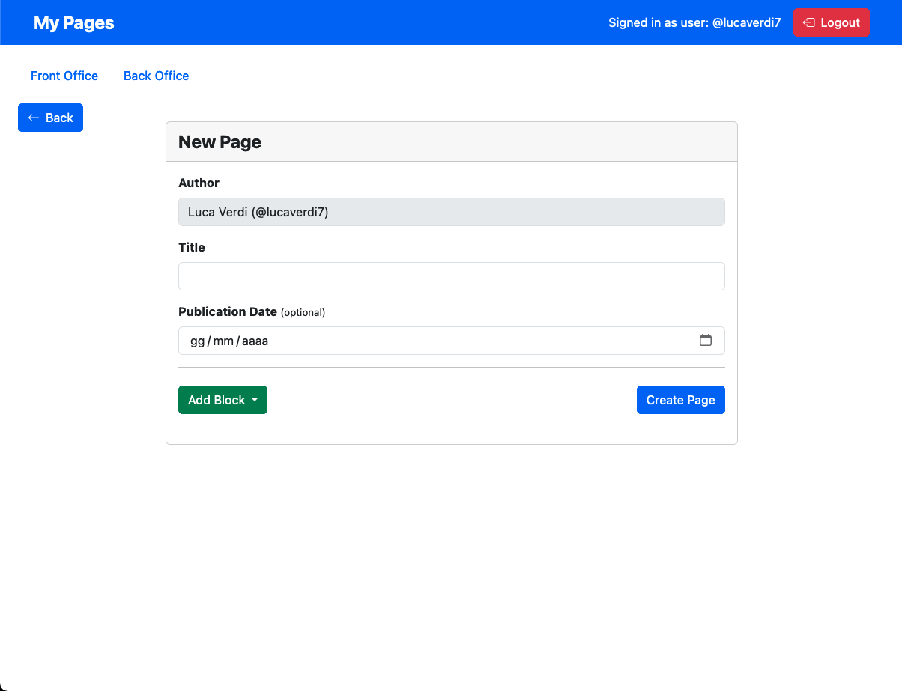
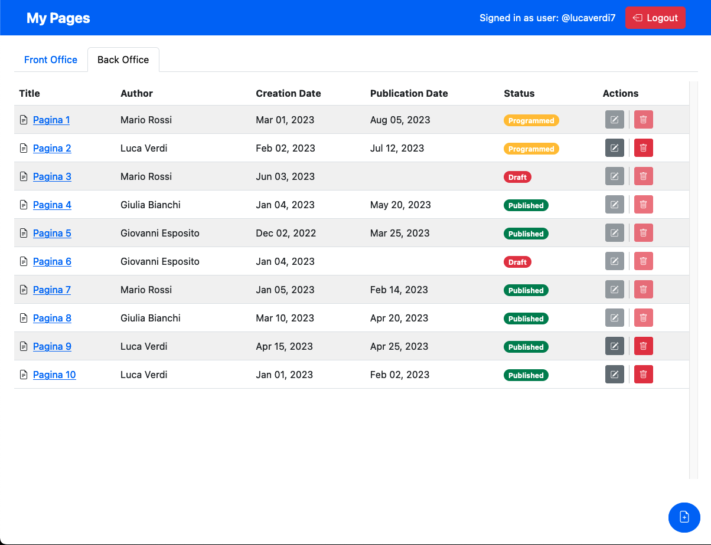

[](https://classroom.github.com/a/suhcjUE-)

# Exam #1: "CMSmall"

## Student: s308747 VALERIANO CARLOS GERARDO

## React Client Application Routes

- Route `/`: front office view shows the published pages
- Route `/back-office`: back office view shows all the pages
- Route `/pages/:pageId`: page view shows the content of a page and all its details
- Route `/edit/:pageId`: edit view to edit the information about a page and its content blocks
- Route `/add`: add view to create a new page and add its content blocks
- Route `/login`: login view to make the user login into the website
- Route `*`: wrong route view to handle wrong routes

## API Server

### Authentication

#### Login

- HTTP method: `POST` URL: `/api/sessions`
- Description: authenticate the user who is trying to login
- Request body: credentials of the user who is trying to login

```JSON
{
    "username": "username",
    "password": "password"
}
```

- Response: `200 OK` (success)
- Response body: authenticated user

```JSON
{
    "id": 1,
    "name": "Mario Rossi",
    "email": "u1@p.it",
    "role": "admin",
    "username": "mariorossi99"
}
```

#### Get current session

- HTTP method: `GET` URL: `/api/sessions/current`
- Description: check if current user is logged in and get her data
- Request body: _None_
- Response: `200 OK` (success)
- Response body: authenticated user

```JSON
{
    "id": 1,
    "name": "Mario Rossi",
    "email": "u1@p.it",
    "role": "admin",
    "username": "mariorossi99"
}
```

- Error responses: `500 Internal Server Error` (generic error), `401 Unauthorized User` (user is not logged in)

#### Logout

- HTTP method: `DELETE` URL: `/api/sessions/current`
- Description: logout current user
- Request body: _None_
- Response: `200 OK` (success)
- Response body: _None_
- Error responses: `500 Internal Server Error` (generic error), `401 Unauthorized User` (user is not logged in)

#### Get users names

- HTTP method: `GET` URL: `/api/users`
- Description: authenticated route, get the list of users names
- Request body: _None_
- Response: `200 OK` (success)
- Response body: users names array

```JSON
[
  {
    "name": "Mario Rossi",
    "username": "mariorossi99"
  },
  {
    "name": "Luca Verdi",
    "username": "lucaverdi7"
  },
  ...
]
```

- Error responses: `500 Internal Server Error` (database error), `401 Unauthorized User` (user is not logged in), `403 Forbidden` (user is not admin)

### Static Images

- HTTP method: `GET` URL: `/api/images`
- Description: get the list of image names in the 'static' folder
- Request body: _None_
- Response: `200 OK` (success)
- Response body: image names array

```JSON
[
    "car.jpeg",
    "football.jpeg",
    ...
]
```

- Error responses: `500 Internal Server Error` (generic error)

### Page Management

#### Get all the pages

- HTTP method: `GET` URL: `/api/pages`
- Description: authenticated route, get the full list of pages
- Request body: _None_
- Response: `200 OK` (success)
- Response body: page objects array

```JSON
[
  {
    "id": 1,
    "title": "Pagina 1",
    "creationDate": "Mar 01, 2023",
    "publicationDate": "Aug 05, 2023",
    "author": {
      "name": "Mario Rossi",
      "username": "mariorossi99"
    },
    "status": "programmed"
  },
  {
    "id": 2,
    "title": "Pagina 2",
    "creationDate": "Feb 02, 2023",
    "publicationDate": "Jul 12, 2023",
    "author": {
      "name": "Luca Verdi",
      "username": "lucaverdi7"
    },
    "status": "programmed"
  },
  ...
]
```

- Error responses: `500 Internal Server Error` (generic error), `401 Unauthorized User` (user is not logged in)

#### Get published pages

- HTTP method: `GET` URL: `/api/published-pages`
- Description: not authenticated route, get the list of published pages sorted by publicationDate
- Request body: _None_
- Response: `200 OK` (success)
- Response body: page objects array (same as previous route)
- Error responses: `500 Internal Server Error` (generic error)

#### Get page by id

- HTTP method: `GET` URL: `/api/pages/:id`
- Description: not authenticated route, get a single page and its content blocks
- Request body: _None_
- Response: `200 OK` (success)
- Response body: a page object

```JSON
{
  "id": 1,
  "title": "Pagina 1",
  "creationDate": "Mar 01, 2023",
  "publicationDate": "Aug 05, 2023",
  "author": {
    "name": "Mario Rossi",
    "username": "mariorossi99"
  },
  "status": "programmed",
  "blocks": [
    {
      "id": 1,
      "type": "header",
      "content": "Titolo della pagina 1",
      "position": 1
    },
    {
      "id": 2,
      "type": "paragraph",
      "content": "Contenuto del paragrafo 2",
      "position": 2
    }
  ]
}
```

- Error responses: `500 Internal Server Error` (generic error), `401 Unauthorized User` (user is not logged in), `404 Not Found` (author is not in the db)

#### Create a new page

- HTTP method: `POST` URL: `/api/pages`
- Description: authenticated route, create a new page and its content blocks
- Request body: description of the page to be created and all its content blocks

```JSON
{
  "title": "Test page",
  "authorUsername": "mariorossi99",
  "publicationDate": "",
  "blocks": [
    {
      "type": "header",
      "content": "Test header",
      "position": 1
    },
    {
      "type": "paragraph",
      "content": "Test paragraph",
      "position": 2
    }
  ]
}
```

- Response: `200 OK` (success)
- Response body: one object describing the created page (same as previous route)
- Error responses: `500 Internal Server Error` (database error), `401 Unauthorized User` (user is not logged in), `403 Forbidden` (user is not admin), `404 Not Found` (author is not in the db)

#### Update an existing page

- HTTP method: `PUT` URL: `/api/pages/:id`
- Description: authenticated route to update an existing page
- Request body: description of the page to be modified and all its content blocks

```JSON
{
  "id": 15,
  "title": "Test page",
  "authorUsername": "mariorossi99",
  "publicationDate": "2023-07-30",
  "blocks": [
    {
      "id": 46,
      "type": "header",
      "content": "Test header",
      "position": 1
    },
    {
      "id": 47,
      "type": "paragraph",
      "content": "Test paragraph",
      "position": 2
    }
  ]
}
```

- Response: `200 OK` (success)
- Response body: one object describing the modified page (same as previous route)
- Error responses: `500 Internal Server Error` (database error), `401 Unauthorized User` (user is not logged in), `403 Forbidden` (user is not admin), `404 Not Found` (author is not in the db)

#### Delete an existing page

- HTTP method: `DELETE` URL: `/api/pages/:id`
- Description: authenticated route to delete an existing page
- Request body: _None_
- Response: `200 OK` (success)
- Response body: an empty object
- Error responses: `500 Internal Server Error` (database error), `401 Unauthorized User` (user is not logged in), `403 Forbidden` (user is not admin), `404 Not Found` (author or page are not in the db)

### App Configuration

#### Get the app config

- HTTP method: `GET` URL: `/api/config`
- Description: not authenticated route, get the app configuration containing the app name
- Request body: _None_
- Response: `200 OK` (success)
- Response body: one object describing the app config

```JSON
{
  "app_name": "My Pages",
}
```

- Error responses: `500 Internal Server Error` (generic error)

#### Edit the app config

- HTTP method: `PUT` URL: `/api/config`
- Description: authenticated route to allow an admin user to edit the app configuration
- Request body: one object with the new config

```JSON
{
  "app_name": "Web App I",
}
```

- Response body: one object describing the modified app config (same as previous route)
- Error responses: `500 Internal Server Error` (database error), `401 Unauthorized User` (user is not logged in), `403 Forbidden` (user is not admin)

## Database Tables

- Table `users` - (id, fullname, email [unique], role, username [unique], salt, hash)
- Table `pages` - (id, title, author_id [foreign key users(id)], creation_date, publication_date)
- Table `blocks` - (id, page_id [foreign key pages(id)], type, content, position)
- Table `config` - (app_name)

## Main React Components

- `Main` (in `App.jsx`): root component to set all the routes, provide some handlers for errors, login, logout, load and refetch data and setup initial state of the application.
- `DefaultLayout` (in `AppLayout.jsx`): component showed in the '/' route to display the navigation bar, the navigation tabs, and all its children through the Outlet component.
- `Navigation` (in `Navigation.jsx`): navigation bar component to show the app name and the login/logout buttons as well as showing the form to change the app name.
- `NavTabs` (in `Navigation.jsx`): navigation tabs to switch between the front-office and the back-office routes.
- `NavForm` (in `Navigation.jsx`): very small form shown in-line with the navigation bar to change the app name (only if admin).
- `PageTable` (in `PageList.jsx`): table to show the pages in the '/' and '/back-office' routes. Each row in the table can show or hide the page action buttons accordingly to the tab selected. Each row allows the user to view the page in detail, to edit it and to delete it.
- `PageLayout` (in `AppLayout.jsx`): component used in the '/pages', '/edit' and '/add' routes to show either the page view that displays how the page is looking so far, or the page form to edit some page properties and all the content blocks or to create a page from scratch. It is able to load the single page data accordingly given the route parameter :id, if present. It also provides functions to call the create and edit page APIs, as well as other data such as the list of users and the list of images.
- `PageView` (in `PageView.jsx`): component that displays all the information about a specific page and shows all its content blocks.
- `PageForm` (in `PageForm.jsx`): form component to let the user change the informations about a page or all the content blocks. In particular, it allows to add new blocks, edit the content of each block, remove any block and change the position of a block inside the page.
- `ImagePicker` (in `ImagePicker.jsx`): modal component that shows some images to let the user pick an image for a content block inside a page when she's creting a new block or editing one of image type.
- `LoginForm` (in `Auth.jsx`): small form to allow the user to login into the application.

## Screenshot




## Users Credentials

- email: u1@p.it, password: pwd, role: admin
- email: u2@p.it, password: pwd, role: user
- email: u3@p.it, password: pwd, role: user
- email: u4@p.it, password: pwd, role: user
- email: u5@p.it, password: pwd, role: user
